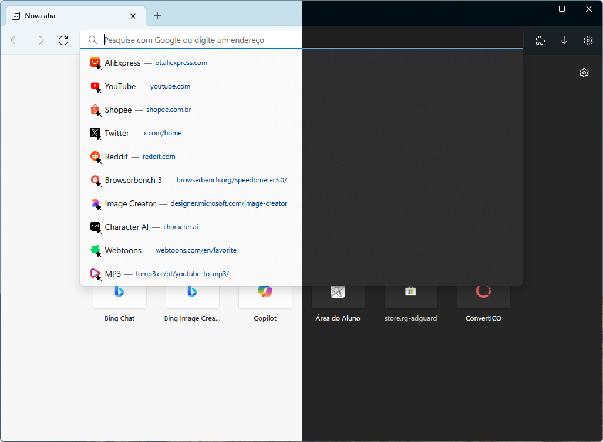

# Firefox 115 WinUI
An edited version of an old release of [bmFtZQ](https://github.com/bmFtZQ)'s [Edge-frfx](https://github.com/bmFtZQ/Edge-FrFox) theme with some [tweaks by MrOtherGuy](https://github.com/MrOtherGuy/firefox-csshacks) to match Microsoft's WinUI design guidelines.

## Note: This theme is currently only compatible with Firefox 115 ESR due to the removal of support for `-moz-win-borderless-glass` and `-moz-win-glass`.

<!-- Use  element to set a maximum width. -->

Screenshot: Windows 11 / Floorp 11.16.0

## How to install
1. Go to the root directory of your browser profile.
2. Download the repository and extract the files.
3. From the repository folder, copy the `chrome` folder into your Firefox profile folder.
4. Close and restart Firefox, if performed correctly, the theme should now be installed.
5. Go to `about:config` and create the following boolean key and set it to true `uc.tweak.win11-mica`.
6. Download [Mica For Everyone](https://github.com/MicaForEveryone/MicaForEveryone) and change Firefox's backdrop to tabbed.
